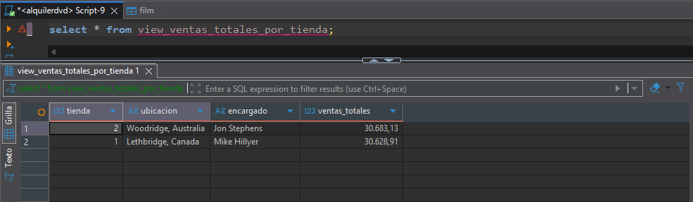
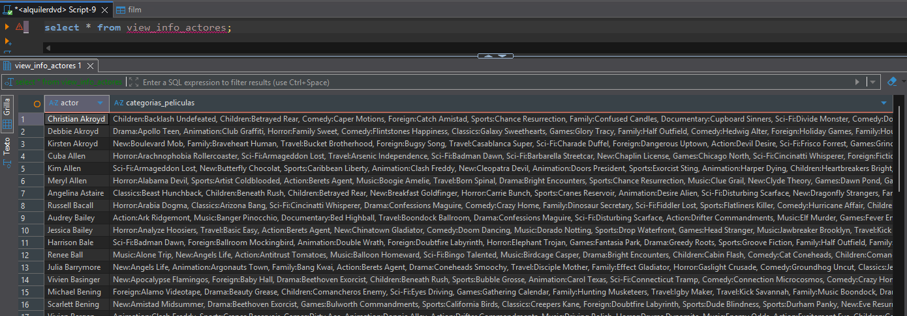

# Modelo Relacional: Vistas y Disparadores

- **Alumno:** Adrián García Rodríguez
- **Correo:** alu0101557977@ull.edu.es

## Restauración de la base de datos

Utilizamos el comando `pg_restore` para restaurar una copia de seguridad (backup) de una base de datos PostgreSQL a partir del archivo AlquilerPractica.tar. Esta copia contiene la estructura y los datos de la base de datos perteneciente a la franquicia *Blockbuster LLC*, especializada en el alquiler de películas y videojuegos.


Durante la ejecución, `pg_restore` trató de aplicar un comando de permisos incluido en la copia de seguridad:

```sql
GRANT ALL ON DATABASE alquilerdvd TO cliente;
```

No obstante, PostgreSQL generó el siguiente error:

```vbnet
ERROR: role "cliente" does not exist
```

Esto significa que en el servidor actual no existe un rol o usuario llamado `cliente`, al cual el respaldo intenta otorgar permisos sobre la base de datos `alquilerdvd`. Sin embargo, esto no nos supone un problema, pues estaremos realizando los ejercicios con el usuario `postgres`, por lo que ignoraremos esta advertencia.

## Identificación de tablas, vistas y secuencias

Para identificar las tablas, vistas y secuencias, ejecutamos el metacomando `\d+`, que sirve para describir las relaciones de la base de datos actual, mostrando información detallada sobre cada una.

```bash
                                                 List of relations
 Schema |            Name            |   Type   |  Owner   | Persistence | Access method |    Size    | Description 
--------+----------------------------+----------+----------+-------------+---------------+------------+-------------
 public | actor                      | table    | postgres | permanent   | heap          | 40 kB      | 
 public | actor_actor_id_seq         | sequence | postgres | permanent   |               | 8192 bytes | 
 public | address                    | table    | postgres | permanent   | heap          | 88 kB      | 
 public | address_address_id_seq     | sequence | postgres | permanent   |               | 8192 bytes | 
 public | category                   | table    | postgres | permanent   | heap          | 8192 bytes | 
 public | category_category_id_seq   | sequence | postgres | permanent   |               | 8192 bytes | 
 public | city                       | table    | postgres | permanent   | heap          | 64 kB      | 
 public | city_city_id_seq           | sequence | postgres | permanent   |               | 8192 bytes | 
 public | country                    | table    | postgres | permanent   | heap          | 8192 bytes | 
 public | country_country_id_seq     | sequence | postgres | permanent   |               | 8192 bytes | 
 public | customer                   | table    | postgres | permanent   | heap          | 96 kB      | 
 public | customer_customer_id_seq   | sequence | postgres | permanent   |               | 8192 bytes | 
 public | film                       | table    | postgres | permanent   | heap          | 736 kB     | 
 public | film_actor                 | table    | postgres | permanent   | heap          | 272 kB     | 
 public | film_category              | table    | postgres | permanent   | heap          | 72 kB      | 
 public | film_film_id_seq           | sequence | postgres | permanent   |               | 8192 bytes | 
 public | inventory                  | table    | postgres | permanent   | heap          | 232 kB     | 
 public | inventory_inventory_id_seq | sequence | postgres | permanent   |               | 8192 bytes | 
 public | language                   | table    | postgres | permanent   | heap          | 8192 bytes | 
 public | language_language_id_seq   | sequence | postgres | permanent   |               | 8192 bytes | 
 public | payment                    | table    | postgres | permanent   | heap          | 896 kB     | 
 public | payment_payment_id_seq     | sequence | postgres | permanent   |               | 8192 bytes | 
 public | rental                     | table    | postgres | permanent   | heap          | 1232 kB    | 
 public | rental_rental_id_seq       | sequence | postgres | permanent   |               | 8192 bytes | 
 public | staff                      | table    | postgres | permanent   | heap          | 16 kB      | 
 public | staff_staff_id_seq         | sequence | postgres | permanent   |               | 8192 bytes | 
 public | store                      | table    | postgres | permanent   | heap          | 8192 bytes | 
 public | store_store_id_seq         | sequence | postgres | permanent   |               | 8192 bytes | 
(28 rows)
```

### Tablas

El modelo relacional de la base de datos `alquilerdvd` se estructura alrededor de la entidad `film` y sus relaciones con `customer`, `rental` y `payment`.

- **`actor`** – Información de los actores.
- **`address`** – Direcciones asociadas a clientes, empleados y tiendas.
- **`category`** – Categorías o géneros de las películas.
- **`city`** – Ciudades de las direcciones.
- **`country`** – Países donde se encuentran las ciudades.
- **`customer`** – Datos de los clientes.
- **`film`** – Información de las películas.
- **`film_actor`** – Relación entre películas y actores.
- **`film_category`** – Relación entre películas y categorías.
- **`inventory`** – Copias físicas de las películas disponibles en las tiendas.
- **`language`** – Idiomas de las películas.
- **`payment`** – Pagos realizados de los alquileres.
- **`rental`** – Registros de alquileres y devoluciones.
- **`staff`** – Empleados que trabajan en las tiendas.
- **`store`** – Tiendas de la franquicia.

### Secuencias

Cada tabla con clave primaria (todas, a excepción de las que representan una relación entre dos entidades) tiene una secuencia asociada para la generación automática de identificadores:

- **`actor_actor_id_seq`**  
- **`address_address_id_seq`**  
- **`category_category_id_seq`**  
- **`city_city_id_seq`**  
- **`country_country_id_seq`** 
- **`customer_customer_id_seq`**  
- **`film_film_id_seq`**  
- **`inventory_inventory_id_seq`**  
- **`language_language_id_seq`**  
- **`payment_payment_id_seq`**  
- **`rental_rental_id_seq`**  
- **`staff_staff_id_seq`**  
- **`store_store_id_seq`**

### Vistas

No se encontraron **vistas definidas** en el esquema.

## Identificación de tablas principales

### Tabla `film`

**Descripción:**  
Contiene la información principal de las películas disponibles para alquiler.

**Campos principales:**
- `film_id`: clave primaria.
- `title`, `description`: título y descripción de la película.
- `release_year`, `language_id`: año de lanzamiento e idioma.
- `rental_duration`, `rental_rate`: duración y tarifa de alquiler.
- `length`, `replacement_cost`: duración y coste de reemplazo.
- `rating`: clasificación por edades.
- `special_features`, `fulltext`: características especiales y campo de búsqueda.

**Relaciones:**
- (FK) `language_id` → `language(language_id)`
- Relacionada con `film_actor`, `film_category`, `inventory`.

---

### Tabla `actor`

**Descripción:**  
Almacena los actores que participan en las películas.

**Campos principales:**
- `actor_id`: clave primaria.
- `first_name`, `last_name`: nombre y apellido del actor.

**Relaciones:**
- Participa en la relación N:M con `film` a través de `film_actor`.

---

### Tabla `customer`

**Descripción:**  
Registra la información de los clientes que alquilan películas.

**Campos principales:**
- `customer_id`: clave primaria.
- `store_id`: tienda a la que está afiliado.
- `first_name`, `last_name`, `email`: datos del cliente.
- `address_id`: dirección asociada.
- `active`, `create_date`, `last_update`: estado y fechas.

**Relaciones:**
- (FK) `address_id` → `address(address_id)`
- (FK) `store_id` → `store(store_id)`
- Relacionada con `rental` y `payment`.

---

### Tabla `inventory`

**Descripción:**  
Representa las copias físicas de las películas disponibles en las tiendas.

**Campos principales:**
- `inventory_id`: clave primaria.
- `film_id`, `store_id`: película y tienda asociada.

**Relaciones:**
- (FK) `film_id` → `film(film_id)`
- (FK) `store_id` → `store(store_id)`
- Relacionada con `rental` y `store`.

---

### Tabla `rental`

**Descripción:**  
Registra los alquileres realizados por los clientes.

**Campos principales:**
- `rental_id`: clave primaria.
- `rental_date`, `return_date`: fechas de alquiler y devolución.
- `inventory_id`, `customer_id`, `staff_id`: claves foráneas.

**Relaciones:**
- (FK) `inventory_id` → `inventory(inventory_id)`
- (FK) `customer_id` → `customer(customer_id)`
- (FK) `staff_id` → `staff(staff_id)`
- Relacionada con `payment`.

---

### Tabla `payment`

**Descripción:**  
Contiene el registro de los pagos efectuados de los alquileres.

**Campos principales:**
- `payment_id`: clave primaria.
- `customer_id`, `staff_id`, `rental_id`: efectuador, responsable y alquiler asociado al pago.
- `amount`, `payment_date`: costo y fecha del pago.

**Relaciones:**
- (FK) `customer_id` → `customer(customer_id)`
- (FK) `rental_id` → `rental(rental_id)`
- (FK) `staff_id` → `staff(staff_id)`

---

### Tabla `store`

**Descripción:**  
Define las tiendas de la franquicia.

**Campos principales:**
- `store_id`: clave primaria.
- `manager_staff_id`: empleado encargado.
- `address_id`: dirección de la tienda.

**Relaciones:**
- (FK) `manager_staff_id` → `staff(staff_id)`
- (FK) `address_id` → `address(address_id)`
- Relacionada con `inventory` y `customer`.

---

### Tabla `staff`

**Descripción:**  
Registra los empleados de las tiendas.

**Campos principales:**
- `staff_id`: clave primaria.
- `first_name`, `last_name`, `email`: información personal.
- `address_id`, `store_id`: ubicación, y tienda en la que trabajan.
- `username`, `password`, `active`: credenciales y estado.

**Relaciones:**
- (FK) `address_id` → `address(address_id)`
- (FK) `store_id` → `store(store_id)`
- Relacionada con `store`, `rental`, `payment`.

---

### Tablas de soporte (geográficas y categóricas)

| Tabla | Función | Relaciones principales |
|--------|----------|------------------------|
| **address** | Direcciones de clientes, empleados y tiendas. | (FK) → `city(city_id)` |
| **city** | Ciudades. | (FK) → `country(country_id)` |
| **country** | Países. | — |
| **category** | Categorías o géneros de las películas. | Relacionada con `film_category`. |
| **language** | Idiomas de las películas. | Relacionada con `film`. |

---

### Tablas intermedias (relaciones N:M)

| Tabla | Función | Relaciones |
|--------|----------|-------------|
| **film_actor** | Relación N:M entre `film` y `actor`. | (FK) → `film(film_id)` y `actor(actor_id)` |
| **film_category** | Relación N:M entre `film` y `category`. | (FK) → `film(film_id)` y `category(category_id)` |

---

### Triggers

Todas las tablas incluyen un **trigger `last_updated`** que actualiza automáticamente la columna `last_update` de cada tabla, antes de cada modificación.  

Además, la tabla `film` tiene un **trigger de texto completo** (`film_fulltext_trigger`) para mantener el campo `fulltext`, que permite realizar búsquedas de películas de forma rápida y eficiente.

## Consultas

### Ventas totales por categoría

Obtener las ventas totales por categoría de películas ordenadas descendentemente.

```sql
create or replace view view_ventas_totales_por_categoria as
select c.name as categoria, sum(p.amount) as ventas_totales
from payment p
join rental r on p.rental_id  = r.rental_id
join inventory i on r.inventory_id = i.inventory_id
join film_category fc on i.film_id = fc.film_id
join category c on fc.category_id = c.category_id
group by categoria
order by ventas_totales desc;
```


### Ventas totales por tienda

Obtener las ventas totales por tienda, donde se refleja la ciudad, el país (concatenar la ciudad y el país empleando como separador la ","), y el encargado.

```sql
select s.store_id as tienda,
       concat(ci.city, ', ', co.country) as ubicacion,
       concat(m.first_name, ' ', m.last_name) as encargado,
       sum(p.amount) as ventas_totales
from store s
join staff m on s.manager_staff_id = m.staff_id
join address a on s.address_id = a.address_id
join city ci on a.city_id = ci.city_id
join country co on ci.country_id = co.country_id
join inventory i on s.store_id = i.store_id
join rental r on i.inventory_id = r.inventory_id 
join payment p on r.rental_id = p.rental_id
group by s.store_id, ci.city, co.country, m.first_name, m.last_name
order by ventas_totales desc;
```


### Lista de películas

Obtener una lista de películas, donde se reflejan el identificador, el título, descripción, categoría, el precio, la duración de la película, clasificación, nombre y apellidos de los actores.

```sql
select f.film_id as id_pelicula,
       f.title as titulo,
       f.description as descripcion,
       c.name as categoria,
       f.rental_rate as precio,
       f.length as duracion,
       f.rating::text as clasificacion,
       string_agg(concat(a.first_name, ' ', a.last_name), ', ') as actores
from film f
join film_category fc on f.film_id = fc.film_id
join category c on fc.category_id = c.category_id
join film_actor fa on f.film_id = fa.film_id
join actor a on fa.actor_id = a.actor_id
group by f.film_id, f.title, f.description, c.name, f.rental_rate, f.length, f.rating::text
order by f.film_id;
```


### Información de actores

Obtener la información de los actores, donde se incluye sus nombres y apellidos, las categorías y sus películas. Los actores deben de estar agrupados y, las categorías y las películas deben estar concatenados por “:”.

```sql
select concat(a.first_name, ' ', a.last_name) as actor,
       string_agg(concat(c.name, ':', f.title), ', ') as categorias_peliculas
from actor a
join film_actor fa on a.actor_id = fa.actor_id
join film f on fa.film_id = f.film_id
join film_category fc on f.film_id = fc.film_id
join category c on fc.category_id = c.category_id
group by a.actor_id, a.first_name, a.last_name
order by a.last_name, a.first_name;
```


## Vistas

### Ventas totales por categoría

Obtener las ventas totales por categoría de películas ordenadas descendentemente.

```sql
create or replace view view_ventas_totales_por_categoria as
select c.name as categoria, sum(p.amount) as ventas_totales
from payment p
join rental r on p.rental_id  = r.rental_id
join inventory i on r.inventory_id = i.inventory_id
join film_category fc on i.film_id = fc.film_id
join category c on fc.category_id = c.category_id
group by categoria
order by ventas_totales desc;
```


### Ventas totales por tienda

Obtener las ventas totales por tienda, donde se refleja la ciudad, el país (concatenar la ciudad y el país empleando como separador la ","), y el encargado.

```sql
create or replace view view_ventas_totales_por_tienda as
select s.store_id as tienda,
       concat(ci.city, ', ', co.country) as ubicacion,
       concat(m.first_name, ' ', m.last_name) as encargado,
       sum(p.amount) as ventas_totales
from store s
join staff m on s.manager_staff_id = m.staff_id
join address a on s.address_id = a.address_id
join city ci on a.city_id = ci.city_id
join country co on ci.country_id = co.country_id
join inventory i on s.store_id = i.store_id
join rental r on i.inventory_id = r.inventory_id 
join payment p on r.rental_id = p.rental_id
group by s.store_id, ci.city, co.country, m.first_name, m.last_name
order by ventas_totales desc;
```



### Lista de películas

Obtener una lista de películas, donde se reflejan el identificador, el título, descripción, categoría, el precio, la duración de la película, clasificación, nombre y apellidos de los actores.

```sql
create or replace view view_info_peliculas as
select f.film_id as id_pelicula,
       f.title as titulo,
       f.description as descripcion,
       c.name as categoria,
       f.rental_rate as precio,
       f.length as duracion,
       f.rating::text as clasificacion,
       string_agg(concat(a.first_name, ' ', a.last_name), ', ') as actores
from film f
join film_category fc on f.film_id = fc.film_id
join category c on fc.category_id = c.category_id
join film_actor fa on f.film_id = fa.film_id
join actor a on fa.actor_id = a.actor_id
group by f.film_id, f.title, f.description, c.name, f.rental_rate, f.length, f.rating::text
order by f.film_id;
```


### Información de actores

Obtener la información de los actores, donde se incluye sus nombres y apellidos, las categorías y sus películas. Los actores deben de estar agrupados y, las categorías y las películas deben estar concatenados por “:”.

```sql
create or replace view view_info_actores as
select concat(a.first_name, ' ', a.last_name) as actor,
       string_agg(concat(c.name, ':', f.title), ', ') as categorias_peliculas
from actor a
join film_actor fa on a.actor_id = fa.actor_id
join film f on fa.film_id = f.film_id
join film_category fc on f.film_id = fc.film_id
join category c on fc.category_id = c.category_id
group by a.actor_id, a.first_name, a.last_name
order by a.last_name, a.first_name;
```



## Restricciones CHECK

### Tabla film

- `rental_duration > 0` → asegura que el periodo de alquiler sea positivo.
- `rental_rate >= 0` → evita precios de alquiler negativos.
- `length is null or length > 0` → garantiza que la duración de la película tenga sentido.
- `replacement_cost` >= 0 → evita costos de reposición negativos.

```sql
alter table film
add constraint chk_film_rental_duration check (rental_duration > 0),
add constraint chk_film_rental_rate check (rental_rate >= 0),
add constraint chk_film_length check (length is null or length > 0),
add constraint chk_film_replacement_cost check (replacement_cost >= 0);
```

### Tabla payment

- `amount >= 0` → evita pagos negativos.
- `payment_date <= now()` → impide registrar pagos con fechas futuras.

```sql
alter table payment
add constraint chk_payment_amount check (amount >= 0),
add constraint chk_payment_date check (payment_date <= now());
```

### Tabla rental

- `return_date >= rental_date` → garantiza coherencia temporal (no devolver antes de alquilar).

```sql
alter table rental
add constraint chk_rental_dates check ( return_date is null or return_date >= rental_date);
```

### Tabla staff

- `length(username) >= 3` → asegura nombres de usuario mínimos.
- `password is null or length(password) >= 4` → evita contraseñas excesivamente cortas.

```sql
alter table staff
add constraint chk_staff_username check (length(username) >= 3),
add constraint chk_staff_password check (password is null or length(password) >= 4);
```

### Tabla customer

- `active in (0,1)` → controla estados binarios (activo/inactivo).
- `activebool in (true,false)` → refuerza la misma restricción lógica en el campo booleano.

```sql
alter table customer
add constraint chk_customer_active check (active in (0, 1)),
add constraint chk_customer_activebool check (activebool in (true, false));
```

### Tabla address

- `postal_code is null or postal_code ~ '^[0-9A-Za-z-]+$'` → valida formato alfanumérico correcto.
- `phone is null or phone ~ '^[+]?([0-9]{1,3})?[0-9]{6,12}$'` → asegura que sea un número telefónico válido.

```sql
alter table address
add constraint chk_address_postal_code check (postal_code is null or postal_code ~ '^[0-9A-Za-z-]+$'),
add constraint chk_address_phone check (phone is null or phone ~ '^[+]?([0-9]{1,3})?[0-9]{6,12}$');
```

## Explicación del trigger en customer

Consideremos la siguiente sentencia que aparece en la tabla `customer`:

```sql
last_updated BEFORE UPDATE ON customer 
FOR EACH ROW EXECUTE PROCEDURE last_updated() 
```

Dicha sentencia define un *trigger* llamado `last_update` que se activa antes de ejecutar una actualización en la tabla mencionada. El disparador llama a la función `last_updated()`, que actualiza el campo `last_update` de la tabla con la fecha y hora actual. Esta función es ejecutada por cada fila modificada.

En otras palabras, este *trigger* mantiene automáticamente actualizada la columna `last_update` de la tabla `customer` cada vez que se modifica un registro del cliente, sin necesidad de hacerlo manualmente con cada `UPDATE`.

Todas las tablas de la base de datos, salvo `payment`, utilizan un *trigger* con la misma definición.

## Registro de inserción de películas

Primero, creamos la tabla que almacenará el registro de inserción de las películas. En este caso, si una película es eliminada, su registro de inserción también.

```sql
create table film_inserts_log (
  film_id INT primary key,
  insert_date TIMESTAMP not null,
  constraint fk_film_inserts_log foreign key (film_id) references film(film_id) on delete cascade
);
```


Posteriormente, creamos la función a la que llamará el disparador cuando se inserte una nueva película. Esta función será la que registre la inserción en la nueva tabla.

```sql
create or replace function log_film_insert()
returns trigger as $$
begin
  insert into film_inserts_log (film_id, insert_date)
  values (NEW.film_id, now());
  return NEW;
end;
$$ language plpgsql;
```

Por último, construimos el disparador que llamará a la función anterior para registrar la inserción de una nueva película.

```sql
create trigger film_insert_logger
after insert on film
for each row
execute function log_film_insert();
```

Para comprobar el correcto funcionamiento del disparador, insertaremos una nueva película en la tabla `film`.

```sql
insert into film (
  title,
  description,
  release_year,
  language_id,
  rental_duration,
  rental_rate,
  length,
  replacement_cost,
  rating,
  special_features
) values (
  'The Great Scape',
  'Film about an epic scape.',
  2025,
  1,
  5,
  3.99,
  120,
  25.00,
  'PG-13',
  array['Trailers','Behind the Scenes']
);
```


## Registro de eliminación de películas

Primero, creamos la tabla que almacenará el registro de eliminación de las películas. En este caso, si una película se elimina, se podría insertar otra con el mismo `film_id` que la anterior, por lo que necesitaremos un `log_id`.

```sql
create table film_deletes_log (
  log_id SERIAL primary key,
  film_id INT not null,
  delete_date TIMESTAMP not null
);
```


Posteriormente, creamos la función a la que llamará el disparador cuando se elimine una película. Esta función será la que registre la eliminación en la nueva tabla.

```sql
create or replace function log_film_delete()
returns trigger as $$
begin
  insert into film_deletes_log (film_id, delete_date)
  values (OLD.film_id, now());
  return OLD;
end;
$$ language plpgsql;
```

Por último, construimos el disparador que llamará a la función anterior para registrar la eliminación de una película.

```sql
create trigger film_delete_logger
after delete on film
for each row
execute function log_film_delete();
```

Para comprobar el correcto funcionamiento del disparador, eliminaremos una película en la tabla `film`.

```sql
delete from film
where film_id = 1001;
```


## Importancia de las secuencias

**Definición:**

Una secuencia es un objeto de la base de datos que genera valores numéricos únicos y consecutivos. Típicamente se utilizan para los identificadores de las filas en las tablas (`PRIMARY KEY`).

**Funcionamiento:**

Cada vez que se llama a la secuencia (`nextval('secuencia')`), devuelve el último número registrado de la secuencia, incrementando en uno su valor.

**Relevancia:**

- Evita duplicados en claves primarias.
- Automatiza la generación de IDs.
- Permite reutilizar secuencias entre tablas o para distintos propósitos sin afectar a otras operaciones.
- Control de incrementos, ya que se puede ajustar el valor inicial, el incremento, o incluso reiniciar la secuencia si es necesario.